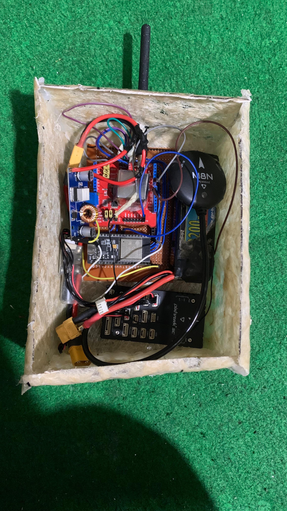
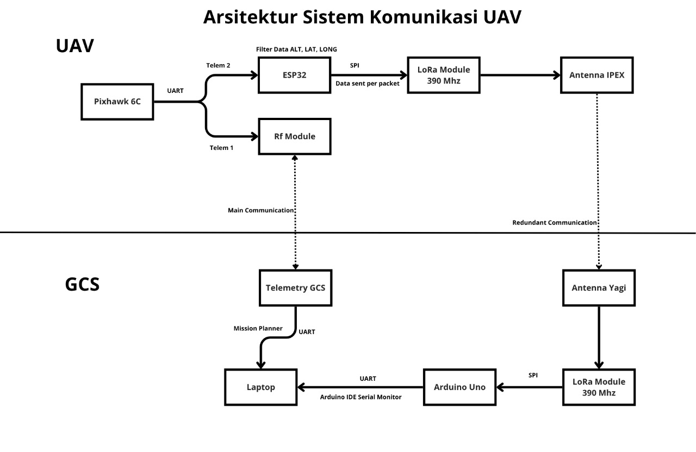
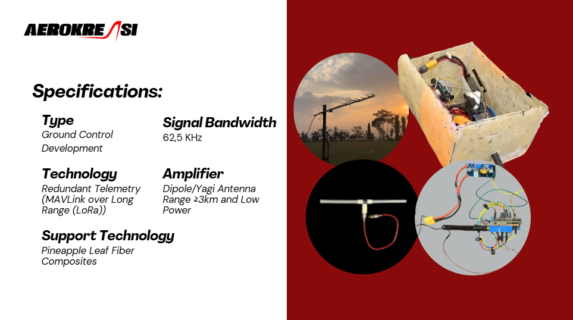

# LoRa Redundancy System for UAV Telemetry



## 📌 Overview
Sistem redundansi komunikasi berbasis LoRa untuk mentransmisikan data telemetri UAV (Altitude, GPS Coordinates, Battery Status, dan Status Text) sebagai backup komunikasi utama.

## 🎯 Tujuan Proyek
- Menyediakan komunikasi backup untuk telemetri UAV menggunakan teknologi LoRa
- Mengurangi risiko kehilangan data ketika komunikasi utama terganggu
- Monitoring real-time parameter kritis UAV dengan latensi rendah

## 📊 Diagram Alur Data


## 🛠️ Spesifikasi Teknis


### **Transmitter (Drone Side)**
- **MCU**: ESP32 (dengan dual core)
- **LoRa Module**: SX1276/SX1278
- **Frekuensi**: 390 MHz
- **Spreading Factor**: 10
- **Bandwidth**: 62.5 kHz
- **Coding Rate**: 4/5
- **TX Power**: 20 dBm
- **Interface**: Serial2 untuk MAVLink (57600 baud)

### **Receiver (Ground Station)**
- **MCU**: Arduino/ESP32
- **LoRa Module**: SX1276/SX1278
- **Frekuensi**: 390 MHz
- **Spreading Factor**: 10
- **Bandwidth**: 62.5 kHz
- **Coding Rate**: 4/5
- **Output**: Serial Monitor (115200 baud)

## 📁 Struktur Data Paket

### **Format Transmisi (Sequential):**
```
Sequence 0: "AL<altitude>"       // Contoh: AL150.50
Sequence 1: "LT<latitude>"       // Contoh: LT-63123456
Sequence 2: "LN<longitude>"      // Contoh: LN106123456
Sequence 3: "BV<voltage>,<soc>"  // Contoh: BV12.45,85
Sequence 4: "ST<status>"         // Contoh: STOK atau STWarning
```

### **Parameter yang Dikirim:**
1. **Altitude**: Ketinggian relatif (meter)
2. **Latitude**: Koordinat lintang (dikalikan 10^7)
3. **Longitude**: Koordinat bujur (dikalikan 10^7)
4. **Battery**: Tegangan (V) dan persentase sisa (%)
5. **Status**: Status text dari UAV (maks 40 karakter)

## 🔧 Instalasi dan Konfigurasi

### **Persyaratan Hardware:**
- 2x Modul LoRa (SX1276/SX1278)
- 1x ESP32 (Transmitter)
- 1x Arduino/ESP32 (Receiver)
- Antena 390MHz (2 pcs)
- Konektor serial untuk MAVLink

### **Library yang Diperlukan:**
#### **Untuk Transmitter:**
```cpp
#include <SPI.h>
#include <LoRa.h>
#include "mavlink.h"  // MAVLink library v2
```

#### **Untuk Receiver:**
```cpp
#include <SPI.h>
#include <LoRa.h>
```

### **Langkah Instalasi:**

1. **Clone repository:**
```bash
git clone https://github.com/yourusername/lora-uav-redundancy.git
```

2. **Install library melalui Arduino IDE:**
   - LoRa by Sandeep Mistry
   - MAVLink (custom library)

3. **Konfigurasi Pin (Transmitter - ESP32):**
```cpp
#define SCK     18
#define MISO    19
#define MOSI    23
#define CS      5
#define RST     14
#define DIO0    26
#define RXD2    16
#define TXD2    17
```

4. **Konfigurasi Pin (Receiver - Arduino):**
```cpp
#define SS      10
#define RST     9
#define DIO0    2
```

## ⚙️ Penggunaan

### **1. Transmitter Setup (di UAV):**
- Hubungkan modul LoRa ke ESP32 sesuai pin configuration
- Hubungkan Serial2 ke Flight Controller (MAVLink output)
- Upload kode transmitter ke ESP32
- LED akan menyala 1 detik saat inisialisasi berhasil

### **2. Receiver Setup (di Ground Station):**
- Hubungkan modul LoRa ke Arduino/ESP32
- Upload kode receiver
- Buka Serial Monitor (115200 baud)
- Sistem siap menerima data

### **3. Monitoring:**
Data akan ditampilkan di Serial Monitor setiap siklus lengkap:
```
========== UAV DATA ==========
Altitude: 150.50 m
Latitude: -63123456
Longitude: 106123456
Battery: 12.45V (85%)
Status: OK
Cycle Time: 520 ms
Avg RSSI: -87.50 dBm
Avg SNR: 8.20 dB
==============================
```

## 📈 Performa Sistem

| Parameter | Nilai | Keterangan |
|-----------|-------|------------|
| **Range** | 1-3 km | Line of sight, lingkungan urban |
| **Update Rate** | ~2 Hz | 5 paket/siklus @ 100ms interval |
| **Latensi** | < 100ms | Per paket |
| **Konsumsi Daya** | ~120mA | Saat transmit |
| **Sensitivitas** | -137 dBm | Pada SF10, BW62.5kHz |
| **Data Rate** | ~250 bps | Effective throughput |

## 🚀 Fitur Unggulan

### **1. Redundansi Otomatis**
- Sistem bekerja parallel dengan komunikasi utama
- Tidak mengganggu sistem existing

### **2. Error Handling**
- Timeout detection (2 detik tanpa data)
- Sequence validation
- Automatic reset pada sequence error

### **3. Monitoring Kualitas Sinyal**
- RSSI (Received Signal Strength Indicator)
- SNR (Signal to Noise Ratio)
- Cycle time measurement

### **4. Low Latency**
- Interval pengiriman: 100ms
- Total cycle time: ~500ms

## 🛡️ Keamanan dan Reliability

### **Data Validation:**
- Checksum implicit melalui sequence system
- Timeout protection
- Data type validation

### **Fail-safe Mechanisms:**
- Auto-reset pada komunikasi terputus
- Default values untuk mencegah data kosong
- LED indicator untuk status sistem

## 🔍 Troubleshooting

| Masalah | Penyebab | Solusi |
|---------|----------|--------|
| **No data received** | Frekuensi tidak match | Pastikan kedua modul di 390MHz |
| **RSSI sangat rendah** | Antena tidak terpasang | Periksa koneksi antenna |
| **Data corrupt** | Interferensi | Ubah spreading factor atau bandwidth |
| **LED tidak menyala** | Power issue | Periksa koneksi power 3.3V |

## 📝 Catatan Penting

1. **Regulasi Frekuensi**: Pastikan penggunaan 390MHz sesuai regulasi lokal
2. **Power Management**: Transmitter mengkonsumsi daya signifikan
3. **Antenna Placement**: Posisi antenna berpengaruh besar pada range
4. **MAVLink Version**: Compatible dengan MAVLink v2

**⚠️ Disclaimer**: Sistem ini sebagai redundansi/redundancy system. Selalu pertahankan sistem komunikasi utama sebagai primary.

**📧 Contact**: [doshansel3@gmail.com]
**🔗 Repository**: [github-link-here]
**📅 Last Updated**: [current-date]
